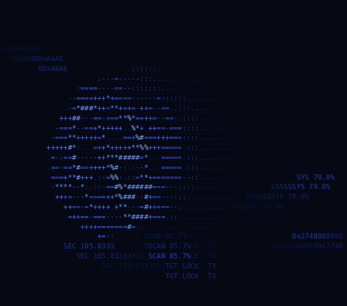
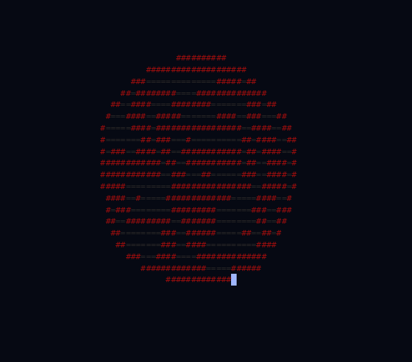

# ORBYN

Screensaver creatures that roam your terminal to prevent screen burn-in: a blue
AI wireframe orb (default) and a red flesh monster (`-carrion`) with dark grey
brain folds.

> AI disclaimer: this project was written with AI assistance; review the code
> before relying on it.

<p align="center">
  
  
</p>

Zero dependencies, single static binary. The default Ultron/Jarvis-flavoured
globe has bounce physics, spiky organic energy bursts, fading cmatrix-style
trails, and roaming telemetry text; `-carrion` swaps it for a red flesh
creature with dark grey brain folds and a fading gore trail. Automatic
truecolor/256/16/mono fallback. Under 1% of one CPU core and ~3 MB RAM at
30 FPS.

## Install

```sh
cargo install --path .
```

## Usage

```sh
orbyn          # blue wireframe orb
orbyn -carrion # red flesh monster
orbyn --help   # every option
```

Keys: `q`/`Ctrl-C` quit, `space` pause, `h` toggle telemetry (orb) or body
detail (carrion), `+`/`-` speed.
Use a dark terminal theme. The terminal is restored on quit, panic, and
`SIGTERM`/`SIGHUP`.

## Samples

`scripts/samples.sh` regenerates the GIFs above from fixed seeds using orbyn's
headless `--cast` mode (single frames: `--snapshot`) and
[agg](https://github.com/asciinema/agg):

```sh
cargo install --git https://github.com/asciinema/agg
scripts/samples.sh
```

## License

[DO WHATEVER YOU WANT LICENSE](LICENSE).
