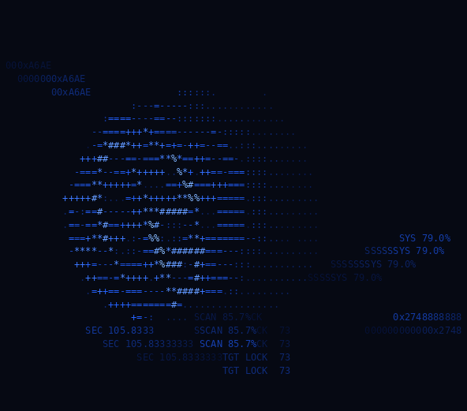
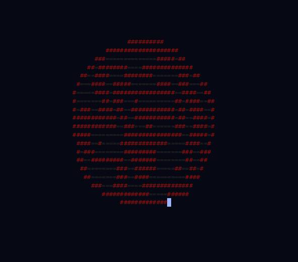

# orbyn

ORBYN is a terminal screensaver that moves bright pixels around the screen to
prevent burn-in on displays left showing a static terminal. It has two visuals:
a blue wireframe orb by default, and a red flesh creature selected with
`-carrion`.

> AI disclaimer: this project was written with AI assistance; review the code
> before relying on it.

<p align="center">
  
  
</p>

The orb bounces around the screen with fading cmatrix-style trails, organic
energy bursts, and drifting telemetry text. `-carrion` replaces it with a red
flesh creature that has dark grey brain folds, a fading gore trail, and a
Crawl/Grip/Lunge motion cycle. Color output falls back automatically from
truecolor to 256, 16, or mono according to the terminal, `COLORTERM`, `TERM`,
and `NO_COLOR`.

## Build and install

Requires Rust 1.70 or newer. The crate has no dependencies.

```sh
cargo install --path .
```

## Usage

Run `orbyn` with no arguments in a terminal and it opens an interactive menu:

```sh
orbyn
```

Menu keys:

- `Up` / `Down` — move through the mode list and parameter rows
- `Left` / `Right` — switch between the mode list and the parameter column
- `Enter` — start the focused mode; on the playlist row it toggles playlist
  mode, and on a mode row while playlist mode is on it marks that mode
- `+` / `-` — adjust the focused parameter
- `q` or `Esc` — quit

### Direct run

Skip the menu and start immediately with `--run`, or pick a mode up front:

```sh
orbyn --run          # start the default orb immediately, no menu
orbyn --mode carrion # named mode
orbyn -carrion       # shorthand for the carrion mode
```

Direct runs apply every option below and use the run-phase keys:

| Key | Action |
| --- | --- |
| `q`, `Ctrl-C`, `Ctrl-D` | quit |
| `space` | pause |
| `h` | toggle telemetry (orb) or body detail (carrion) |
| `n` | swap to the next being now |
| `+`, `=` / `-`, `_` | speed up / slow down |

### Rotation

`--playlist` and `--rotate` cycle through beings:

```sh
orbyn --playlist orb,carrion --rotate 30  # listed beings, swap every 30s
orbyn --playlist all                      # every being, every 300s
orbyn --rotate 45                         # every being, every 45s
```

- `--playlist <NAMES>` takes a comma-separated list of modes, or `all`. On its
  own it rotates through them every 300 seconds.
- `--rotate <SECS>` sets the seconds between swaps. On its own it rotates
  through every being.
- Rotation swaps to the next being when the interval elapses; press `n` to jump
  to the next being immediately.

The terminal is restored on normal quit, panic, and `SIGINT`/`SIGTERM`/`SIGHUP`.
Use a dark terminal theme.

## Options

| Option | Description | Default |
| --- | --- | --- |
| `--mode <NAME>` | Start directly in a named mode | menu |
| `--playlist <NAMES>` | Modes to rotate through, comma-separated or `all` | — |
| `--rotate <SECS>` | Seconds between rotation swaps | `300` |
| `--run` | Skip the menu and start immediately | off |
| `-carrion`, `--carrion` | Use the red flesh creature instead of the orb | orb |
| `-s`, `--speed <FLOAT>` | Motion speed multiplier, 0.05–20.0 | `1.0` |
| `--fps <N>` | Frames per second, 1–240 | `30` |
| `--size <ROWS>` | Body radius in text rows, 1–60 | auto |
| `--trail <FLOAT>` | Trail persistence, 0.0–0.97; higher is longer | `0.82` |
| `--color <MODE>` | `auto`, `truecolor`, `256`, `16`, or `mono` | `auto` |
| `--hud <N>` | Telemetry fragments, 0–64 | `6` |
| `--no-hud` | Disable telemetry fragments | off |
| `--seed <N>` | Fixed RNG seed for reproducible motion | random |

## Headless capture

`--snapshot` renders one frame to stdout and exits; `--cast <FILE>` writes an
asciinema v2 recording. Neither needs a TTY, and both accept `--cols`, `--rows`,
`--warmup`, and `--duration`.

```sh
orbyn --snapshot --cols 120 --rows 40 > frame.ansi
orbyn -carrion --cast carrion.cast --duration 5
```

## Samples

`scripts/samples.sh` regenerates `assets/orb.gif` and `assets/carrion.gif` from
fixed seeds, using `--cast` and [agg](https://github.com/asciinema/agg). It
requires `agg`:

```sh
cargo install --git https://github.com/asciinema/agg
scripts/samples.sh
```

The checked-in GIFs were not regenerated while writing this README.

## License

[DO WHATEVER YOU WANT LICENSE](LICENSE).
